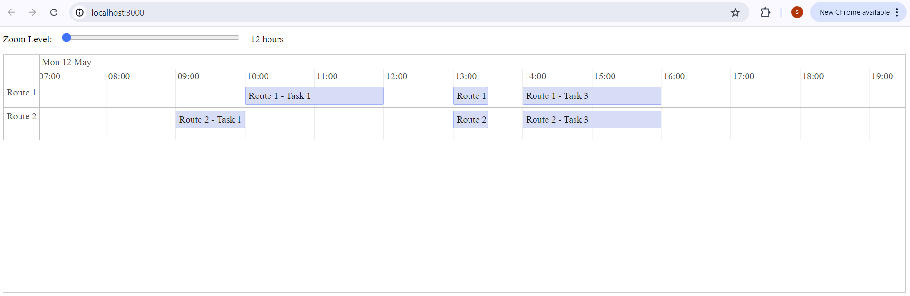

# 📅 React Gantt Chart Viewer

A fast and interactive Gantt chart viewer built with **React** and **vis-timeline**, designed to visualize route-based planning data from JSON input. Includes zoom controls, grouped timelines, and performance optimizations for large datasets.



---

## 🚀 Features

- ✅ Interactive Gantt-style timeline using `vis-timeline`
- 🔍 Zoom control with smooth slider
- ⚡ Optimized with `useMemo` and `useCallback`

---

## 🗂️ Project Structure

```
GANTTCHART/
├── public/               # Static files and HTML template
│   └── index.html
├── src/                  # Application source code
│   ├── components/       # UI components
│   ├── data/             # Sample data
│   └── App.jsx           # Main App component (Entry point)\
├── webpack.config.js     # Webpack build config
├── .gitignore
├── package.json          # Project metadata
└── README.md             # Documentation
```

---

## 🛠️ Technologies Used

- [React](https://reactjs.org/)
- [vis-timeline](https://visjs.github.io/vis-timeline/)
- Webpack
- Babel

---

## ▶️ Getting Started

### ✅ Prerequisites

- Node.js v16 or later
- npm (comes with Node.js)

### 📦 Install Dependencies


`npm install`

### 🚀 Start the Development Server

`npm start`

Open [http://localhost:3000](http://localhost:3000) to view it in the browser.

### 🏗️ Build for Production

`npm run build`

Compiled output will be in the `/dist` folder.

---

## ⚙️ Configuration

Customize paths, port, and build behavior in `webpack.config.js`.

---
